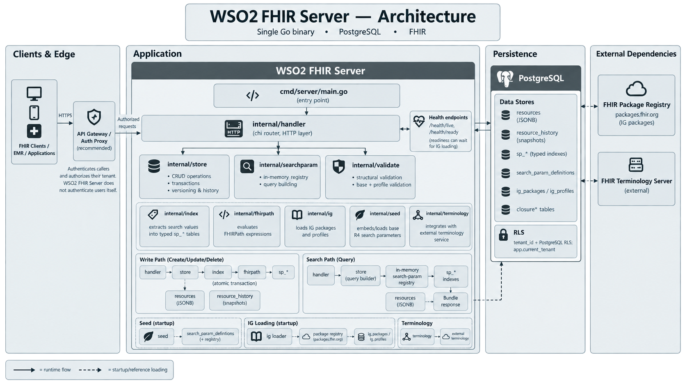

<div align="left">
  <h1>WSO2 FHIR Server</h1>
  <p><strong>WSO2 FHIR Server is a blazing-fast, open-source FHIR server written in Go and backed by PostgreSQL — built for the cloud-native and agentic era.</strong></p>

<!-- License & Project Info -->
[](https://opensource.org/licenses/Apache-2.0)
[](https://hl7.org/fhir/)
[](./go.mod)

<!-- Build & Activity -->
[](https://github.com/wso2/fhir-server/actions/workflows/ci.yml)
[](https://github.com/wso2/fhir-server/releases/latest)
[](https://github.com/wso2/fhir-server/commits/main)
[](https://github.com/wso2/fhir-server/issues)
</div>

## Why WSO2 FHIR Server?

- **Fast.** Write-time indexing and per-query plan selection in PostgreSQL, engineered for FHIR-shaped data.
- **Lightweight.** One binary, one database, a container image under 25 MB — and cold start to ready in under a second.
- **Open source.** Apache 2.0 licensed and community-driven — inspect it, extend it, and own your deployment and your data outright.
- **Cloud-native.** Stateless and Helm-deployable, with health probes, Prometheus metrics, OpenTelemetry tracing, and multi-tenancy built in.
- **Sovereign.** Deploy in your preferred environment — VMs, Docker, Kubernetes, any cloud.

## What is WSO2 FHIR Server?

WSO2 FHIR Server is an open-source FHIR REST server written in Go and backed by PostgreSQL. It is also the fastest open-source FHIR server according to a [third-party performance benchmark](https://healthsamurai.github.io/fhir-server-performance-benchmark/).

Key capabilities:

- **Full FHIR REST API** — CRUD with versioning and history, conditional interactions, batch/transaction bundles, `$everything`, `$validate`, and a generated CapabilityStatement.
- **Rich search** — string, token, date, reference, number, quantity, URI and composite parameters, with modifiers, chaining, `_include`/`_revinclude`, and custom `SearchParameter` registration.
- **Validation** — base-spec checks and referential integrity (on both writes and deletes) enforced by default, opt-in profile validation against loaded Implementation Guides, and `$validate` to test resources without storing them.
- **Implementation Guides** — configure IG packages to load at startup; their profiles and search parameters feed validation and the CapabilityStatement.
- **Terminology** — externalized by design: point the server at any standard FHIR terminology service (e.g. the [WSO2 FHIR terminology service](https://github.com/wso2/open-healthcare-prebuilt-services/tree/main/miscellaneous/terminology-service)) and searches like `code:in=<value-set>` (any code in a value set) or `code:below=<code>` (a code and its descendants) just work.
- **Multi-tenancy** — physical (per-tenant server and database) or logical (shared) isolation models.
- **Operations-ready** — liveness/readiness probes, structured JSON logs, observability hooks, and configuration via YAML, environment variables, or both.

## How does it work?

<div align="left">
  
</div>

Read more in the **[Architecture documentation](https://wso2.github.io/fhir-server/docs/architecture/)**.

## Getting Started

The fastest way to try the server is Docker Compose, using the released container image from [GHCR](https://github.com/wso2/fhir-server/pkgs/container/fhir-server):

```bash
curl -LO https://raw.githubusercontent.com/wso2/fhir-server/main/docker-compose.yml
docker compose up -d
```

Then create your first resource:

```bash
curl -s -X POST http://localhost:9090/fhir/r4/Patient \
  -H "Content-Type: application/fhir+json" \
  -d '{"resourceType":"Patient","name":[{"family":"Smith","given":["Alice"]}]}'
```

Follow the **[Quickstart Guide](https://wso2.github.io/fhir-server/docs/get-started/quickstart/)** for the full walkthrough, or the **[Deployment Guide](https://wso2.github.io/fhir-server/docs/administration/deployment/)** to build from source and run against your own PostgreSQL. For Kubernetes, deploy with the **[Helm chart](./helm/)**.

Don't want to set anything up yourself? Try the hosted demo at **[fhir-explorer.openhealthcare.wso2.com](https://fhir-explorer.openhealthcare.wso2.com/)**.

## Documentation

Full documentation lives at **[wso2.github.io/fhir-server/docs](https://wso2.github.io/fhir-server/docs/)**:

- **[FHIR API](https://wso2.github.io/fhir-server/docs/api/interactions/)** — interactions, [search](https://wso2.github.io/fhir-server/docs/api/search/), [conditional operations](https://wso2.github.io/fhir-server/docs/api/conditional/), and [operations](https://wso2.github.io/fhir-server/docs/api/operations/).
- **[Profiles & Conformance](https://wso2.github.io/fhir-server/docs/conformance/implementation-guides/)** — Implementation Guides, [resource types](https://wso2.github.io/fhir-server/docs/conformance/resource-types/), [validation](https://wso2.github.io/fhir-server/docs/conformance/validation/), and [terminology](https://wso2.github.io/fhir-server/docs/conformance/terminology/), plus a browsable [FHIR262 conformance report](https://wso2.github.io/fhir-server/docs/conformance/fhir262/).
- **[Administration](https://wso2.github.io/fhir-server/docs/administration/deployment/)** — deployment, [configuration](https://wso2.github.io/fhir-server/docs/administration/configuration/), [multi-tenancy](https://wso2.github.io/fhir-server/docs/administration/multi-tenancy/), and [observability](https://wso2.github.io/fhir-server/docs/administration/observability/).
- **[Performance Tuning](./docs/performance-tuning.md)** — storage and PostgreSQL sizing, search tunables, and regression gates.

## Join the Community & Contribute

We'd love for you to be part of the project! Whether you're fixing a bug, improving documentation, or suggesting new features, every contribution counts.

- **[Contributor Guide](./CONTRIBUTING.md)** — learn how to get started.
- **[Testing Guide](https://wso2.github.io/fhir-server/docs/contributing/testing/)** — run the unit and integration test suites.
- **[Report an Issue](https://github.com/wso2/fhir-server/issues)** — help us improve the server.
- **[Security Policy](./SECURITY.md)** — how to report vulnerabilities responsibly.

## AI Agent Team Setup (TribeHealth)

This fork runs an AI agent development team on top of the server. Its KBD phase `agent-team-hardening` extends the team for use as an intermediate EHR that pulls patient data from other EHR systems over FHIR. The roster, models and hand-offs are in **[docs/agent-team.md](./docs/agent-team.md)**; the phase plan is in `.kbd-orchestrator/phases/agent-team-hardening/plan.md`.

### Prerequisites

- **Node.js 24+** on PATH. All project hooks run as `node <script>`.
- **Go 1.25+** with `gofmt`, and **Docker** for integration tests.
- **Python 3** (`python3`, `python` or `py -3`) and the Prometheus `pk` CLI, for Karpathy logging and KBD boundary records. Both degrade gracefully when absent.
- **Git Bash** on Windows, for the KBD orchestrator's stage hooks.
- Harness CLIs, one or more: Claude Code, Codex CLI (`codex`), OpenCode (`opencode`), Kimi Code (`kimi`), MiniMax Code (`mcode`).

### Project hook toolchain

```bash
npm --prefix .claude/hooks ci
npm --prefix .claude/hooks test
npm --prefix .claude/hooks run check:dist
npm --prefix .claude/hooks run lint:agents
npm --prefix .claude/hooks run scan:prometheus
```

### Additional skills to install

Review each source before installing; skills run with full agent permissions. Commits were pinned on 2026-09-25.

1. **Anthropic healthcare plugin** ([anthropics/healthcare](https://github.com/anthropics/healthcare), commit `c7ed150d376b`).
   - **Skills:** `fhir`, `fhir-developer`, `prior-auth`, `procedure-coding`, `icd10-cm`, `clinical-note-extract`, `doc-extract`, `contracts`.
   - **Hosted MCP connectors:** CMS Coverage (LCD/NCD), ICD-10, NPI Registry, Clinical Trials, PubMed.
   - **Install as a plugin only. Do not copy its files into this repo:** the repository has no license file.

   ```text
   # inside Claude Code
   /plugin marketplace add anthropics/healthcare
   /plugin install healthcare@healthcare
   ```

   The hosted connectors (`hcls.mcp.claude.com`) are **not** approved for real patient data. Use them with synthetic or public data only; see *Patient-data policy* below.

2. **Healthcare agents and skills** ([ajhcs/healthcare-agents](https://github.com/ajhcs/healthcare-agents), Apache-2.0, commit `81b239763c06`).
   - **Used for:** the billing, prior-authorization, coding, clinical-documentation, interoperability and compliance roles.
   - **Install from a reviewed, pinned checkout** rather than `npx`/`curl | bash`:

   ```bash
   git clone https://github.com/ajhcs/healthcare-agents.git ~/src/healthcare-agents
   git -C ~/src/healthcare-agents checkout 81b239763c06
   # then, per harness (from that checkout, after reviewing the installer):
   npx --yes healthcare-agents install --agent-skills   # open .agents/skills convention (Codex, Zed, …)
   npx --yes healthcare-agents install --claude-skills  # Claude Code
   npx --yes healthcare-agents install --opencode       # OpenCode
   npx --yes healthcare-agents install --codex          # Codex CLI
   ```

   The phase's change 1 vendors only the selected skills into `.agents/skills/`, with attribution in `THIRD_PARTY_NOTICES.md`.

3. **FHIR developer skill** ([PhenoML/ClaudeFHIRSkill](https://github.com/PhenoML/ClaudeFHIRSkill), Apache-2.0, commit `f472b762acd0`). FHIR R4/R4B/R5 development guidance. Its README now installs from `TopologyHealth/ClaudeFHIRSkill`:

   ```text
   # inside Claude Code
   /plugin marketplace add TopologyHealth/ClaudeFHIRSkill
   /plugin install fhir-developer-skills@ClaudeFHIRSkill
   ```

4. **HIPAA and PHI skills** (machine-local, from the ECC skills collection): `hipaa-compliance`, `healthcare-phi-compliance`, `security-review`, and the `healthcare-reviewer` agent. These are expected in `~/.claude/skills/` and `~/.claude/agents/`.

5. **MiniMax CLI** (`mmx`: MiniMax API, media and search tools; separate from the MiniMax Code harness):

   ```bash
   npm install -g mmx-cli && mmx --version
   mmx auth login --api-key <your-key>            # region is auto-detected
   # if API calls return 401: mmx config set --key region --value global   (or cn)
   npx skills add MiniMax-AI/cli -y -g            # official mmx-cli skill
   mmx quota                                       # confirm Token Plan balance
   ```

6. **OpenSpec skills for every harness** (already committed; re-run to refresh):

   ```bash
   openspec init --tools codex,claude,opencode,kimi,zed,minimax-code --no-animation --no-copilot-cloud
   ```

7. **Other machine-local skills and agents** used by the team: the KBD orchestrator and Prometheus skill pack, the ECC skill collection, and the `superpowers` plugin. They are listed with their sources in the `prerequisites` block of [docs/agent-team.md](./docs/agent-team.md). Agents name any missing skill and continue without it.

MiniMax Code reads agents only from its data directory. For this repo, run it with `MINIMAX_DATA_DIR="$PWD/.minimax" mcode` so it picks up the project's agents (decision ATH-D-003).

### Patient-data policy (decision ATH-D-001)

- **Real PHI only through Tribe Health Solutions' models.** Tribe Health Solutions is the only model provider covered by a HIPAA Business Associate Agreement, and it runs HIPAA-compliant local models. Real PHI may be processed only by sessions routed to those models.
- **Everything else is synthetic or de-identified only.** That covers Claude Code (Anthropic), Codex (OpenAI), Kimi Code (Moonshot) and MiniMax Code (MiniMax cloud), plus the hosted healthcare MCP connectors. Use EHR sandboxes (Epic, Oracle Health, SMART Health IT, HAPI) for integration work.
- **The Tribe endpoint is configuration you supply.** Its URL, model names and key come from environment variables such as `TRIBE_MODEL_BASE_URL`; they are never committed.

### Phase plan: `agent-team-hardening`

#### Build order

| Round | Change | What it delivers |
|---|---|---|
| 1 | `install-domain-skills` | Anthropic's healthcare plugin enabled for Claude (not copied into the repo); the ajhcs and PhenoML skills copied in with attribution; four project skills (EHR onboarding, sync runbook, payer documentation rules, patient-data lane policy); the Firecrawl research written up per role in `evidence/skill-research.md` |
| 2 | `define-portable-team-manifest` | `.agent-team/team.json` as the single source: 14 roles with separate write paths, a patient-data lane rule in every prompt, and a card listing each role's skills, tools and model per harness |
| 3 | `export-team-to-harnesses` | Agent files generated and installed for Claude, Codex, OpenCode, Kimi and MiniMax Code; a check that fails if a generated file is hand-edited; `AGENTS.md` generated from `CLAUDE.md` |
| 4 | `wire-hooks-per-harness` and `retire-merged-agents` (in parallel) | The protected-file guard and ledger hooks wired into each harness's own hook system, with a table of which harnesses support what; the ideation-strategist and knowledge-curator agents removed after their merge |
| 5 | `configure-phi-lanes` | Provider templates for Tribe's endpoint that use environment variables only, plus a guard that blocks FHIR pulls from non-sandbox servers unless the session is on a Tribe lane |
| 6 | `document-and-verify-cross-harness-team` | Docs, CI, the goal check, and a smoke test per harness per new role using synthetic data |

#### Scope choices to be aware of

- **No real patient data this phase.** Tribe's endpoint hasn't been provided yet, so this phase builds the patient-data lanes but doesn't switch any on.
- **The new business roles produce plans, runbooks and governance documents, not Go code.** The integration, sync and billing server features come in a later phase.
- **"Same team everywhere" means the same definitions, not the same behaviour.** Kimi ignores per-agent models, and MiniMax's `mcode exec` can't select an agent; the docs will say so.
- **The recommended hardening items from the last reflection are left for a later phase:**
  - flush thresholds;
  - labelling internal agents;
  - documenting the pre-approved tool lists;
  - pinning `release.yml`.

#### Decisions that can be overruled

- One team file as the single source of truth, with every harness's files generated from it (ATH-D-005).
- Anthropic's healthcare skills installed as a plugin only (ATH-D-006).

#### Review

The cross-model reviewer (gpt-5.5) blocked the plan twice, both times on real gaps:

- **Round 1:** the patient-data rules came after the export, the per-harness cards weren't specified, and the Firecrawl research wasn't a deliverable. All three are fixed.
- **Round 2:** verification could run before the merged agents were removed, the new guard wasn't wired into the other harnesses, and the `AGENTS.md` check wasn't testable. These are fixed too, but that was the last allowed review round, so these fixes haven't been re-reviewed. The plan asks `fhir-conformance-validator` to re-check them during execution.

## License

WSO2 FHIR Server is licensed under Apache 2.0. See the **[LICENSE](./LICENSE)** file for full details.
